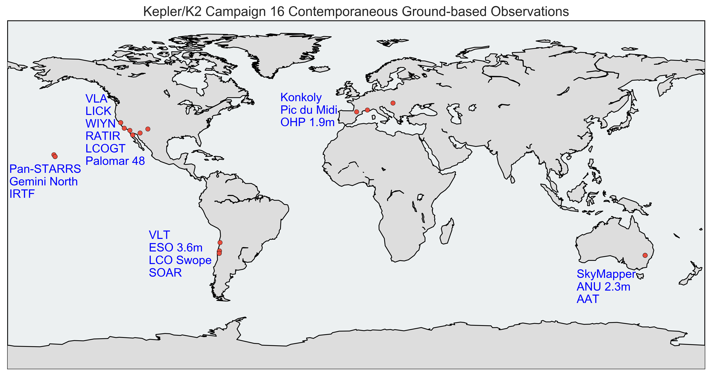

Title: Campaign 16 Coordinated Observations and Upcoming Director's Discretionary Time Deadline
Date: 2017-08-24 14:00
Author: Michael Gully-Santiago

*The deadline for [Campaign 16 Director's Discretionary Time](https://keplerscience.arc.nasa.gov/k2-ddt.html) (DDT) requests is August 31, 2017. *

The [forward-facing K2 Campaign 16](https://keplerscience.arc.nasa.gov/k2-campaign-16-preliminary-target-list-available.html) offers exceptional synergies with ground-based observations from Earth.  Scientists around the world will observe [the Campaign 16 field](https://keplerscience.arc.nasa.gov/images/k2/k2-c16-field.png) contemporaneously with the *Kepler* spacecraft's high precision photometer.  Many of these scientists have already registered their observation plans in [a publicly editable Google Doc](https://keplerscience.arc.nasa.gov/share-your-plan-for-k2-campaign-16-ancillary-observations.html).  We have compiled the user-submitted observatory site locations into this map, revealing a wide range in observing capabilities all pointing at the same K2 C16 field.  This compilation illustrates a tremendous worldwide coordination of effort that will yield a valuable legacy dataset for many disparate science cases.

Many of the observatories will monitor the C16 field every night or near-continuously for the 80 day campaign, providing polychromatic photometry and spectroscopy.  Much of this data will be made publicly available.  In particular, ground-based observations in support of [the K2 Supernova Cosmology Experiment](https://keplerscience.arc.nasa.gov/supernova-experiment/) will continue the tradition of releasing [Astronomer's Telegram](http://www.astronomerstelegram.org/) notices of transient phenomena.  We expect dozens of such transient detections among the thousands of galaxies targeted.
